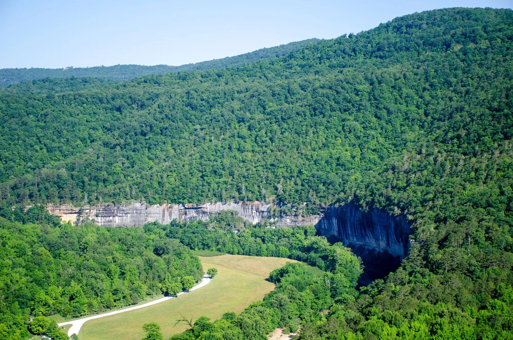
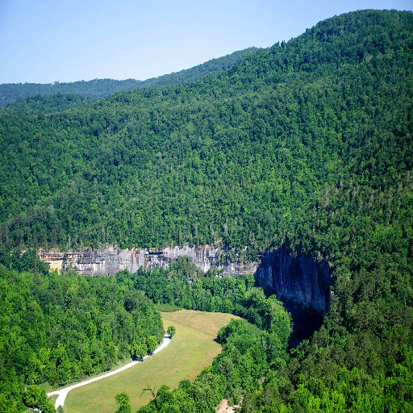
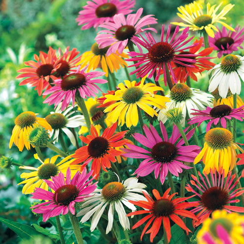
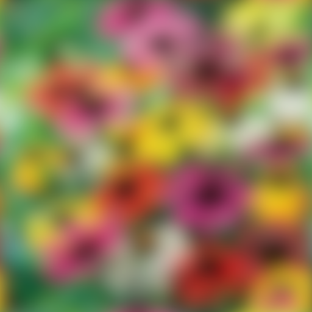
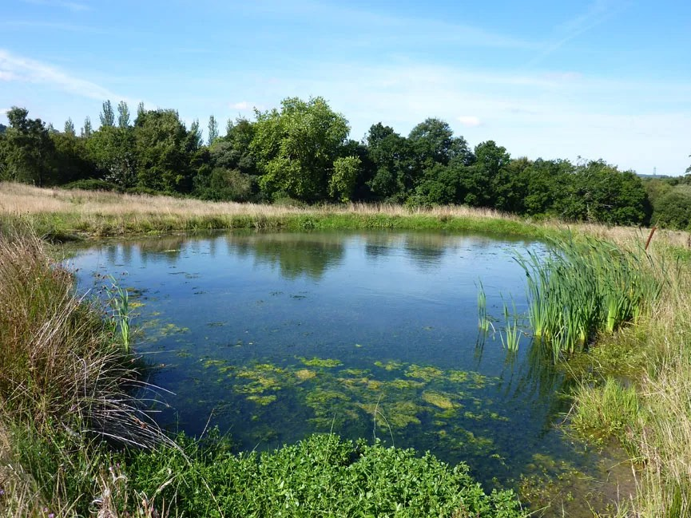
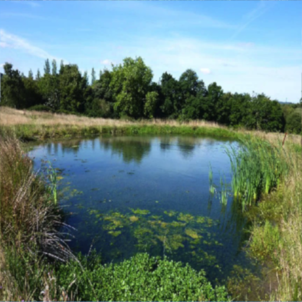

```{R, message=F}
# download the necessary packages
# cannot install the packages all together in a single line, for whatever reason
### on MAC you have to download xquartz; already done using homebrew
#install.packages("AcuityView")
#install.packages("imager")
#install.packages("fftwtools")
#install.packages("magrittr")

# load the installed packages into the environment
library(AcuityView)
library(imager)
library(fftwtools)
library(magrittr)

# set the working directory

setwd("/Users/carilewis/Desktop/Dissertation/Bioinformatics/Data_Wrangling/LewisBIOL7263/Assignments/")
```
 
# 1. Choose five animals from the databases given and calculate their acuity as MRA: 
 
```{R}
# assassin bug
redu_CPD = 0.76
redu_MRA <- 1/redu_CPD

# eagle
eagle_CPD = 140
eagle_MRA <- 1/eagle_CPD

# jumping spider
js_CPD = 12
js_MRA <- 1/js_CPD

# bee
bee_CPD = 0.5
bee_MRA <- 1/bee_CPD

# dragonfly
df_CPD = 2
df_MRA <- 1/df_CPD
```
 
| **Animal** | **CPD** | **MRA** |  
| :---: | :---: | :--- |
| Assassin Bug | `r redu_CPD` | `r redu_MRA`|
| Eagle | `r eagle_CPD` | `r eagle_MRA` |
| Jumping Spider | `r js_CPD` | `r js_MRA` |
| Worker Bee | `r bee_CPD` | `r bee_MRA` |
| Dragonfly | `r df_CPD` | `r df_MRA` |
 
 
# 2.Choose an image that is applicable to each of your animals own ecology (1 image for each animal) and resize that image to 512x512 dimensions: 
 
```{R, message=F}
# load in the image
redu_img <- load.image('redu_cat.jpg') # assassin bug
eagle_img <- load.image('eagle_river.jpg') # eagle
js_img <- load.image('js_fly.jpg') # jumping spider
bee_img <- load.image('bee_flower.jpg') # worker bee
df_img <- load.image('df_pond.jpg') #dragonfly

# make the aspect ratio a square
redu_img <- resize(redu_img, 512, 512)
eagle_img <- resize(eagle_img, 512, 512)
js_img <- resize(js_img, 512, 512)
bee_img <- resize(bee_img, 512, 512)
df_img <- resize(df_img, 512, 512)
```
 
# 3. Create an output of your selected image at distance of 1 m, 2 m, and 3 m for your five animals. 
 
```{R,  message=F}
# Acuity view for assassin bug @ 1 inch, 2 inch, and 3 inches (realistic to this species)
AcuityView(photo = redu_img, # image file
           distance = 1, # distance = distance from viewer to object; same units as realWidth
           realWidth = 1, # realWidth = the real-life width of the image
           eyeResolutionX = redu_MRA, # visual resolution in the X plane
           eyeResolutionY = NULL, # visual resolution in the Y plane; don't change
           plot = T, # shows the plot AND saves it
           output = "redu_1in.jpg") # output image name

AcuityView(photo = redu_img, # image file
           distance = 2, # distance = distance from viewer to object; same units as realWidth
           realWidth = 0.8, # realWidth = the real-life width of the image
           eyeResolutionX = redu_MRA, # visual resolution in the X plane
           eyeResolutionY = NULL, # visual resolution in the Y plane; don't change
           plot = T, # shows the plot AND saves it
           output = "redu_2in.jpg") # output image name

AcuityView(photo = redu_img, # image file
           distance = 3, # distance = distance from viewer to object; same units as realWidth
           realWidth = 0.6, # realWidth = the real-life width of the image
           eyeResolutionX = redu_MRA, # visual resolution in the X plane
           eyeResolutionY = NULL, # visual resolution in the Y plane; don't change
           plot = T, # shows the plot AND saves it
           output = "redu_3in.jpg") # output image name
```
 
# Assassin Bug View of a Caterpillar 
| **Before** | **1 inch** | **2 inch** |  **3 inch** |
| :---: | :---: | :---: | :---: |
|  |  |  |  |

 
```{R, echo=F, message=F}
# Acuity view for eagle @ 100m, 200m, and 300m(realistic to this species)
AcuityView(photo = eagle_img, # image file
           distance = 100, # distance = distance from viewer to object; same units as realWidth
           realWidth = 100, # realWidth = the real-life width of the image
           eyeResolutionX = eagle_MRA, # visual resolution in the X plane
           eyeResolutionY = NULL, # visual resolution in the Y plane; don't change
           plot = T, # shows the plot AND saves it
           output = "eagle_100m.jpg") # output image name

AcuityView(photo = eagle_img, # image file
           distance = 200, # distance = distance from viewer to object; same units as realWidth
           realWidth = 80, # realWidth = the real-life width of the image
           eyeResolutionX = eagle_MRA, # visual resolution in the X plane
           eyeResolutionY = NULL, # visual resolution in the Y plane; don't change
           plot = T, # shows the plot AND saves it
           output = "eagle_200m.jpg") # output image name

AcuityView(photo = eagle_img, # image file
           distance = 300, # distance = distance from viewer to object; same units as realWidth
           realWidth = 60, # realWidth = the real-life width of the image
           eyeResolutionX = eagle_MRA, # visual resolution in the X plane
           eyeResolutionY = NULL, # visual resolution in the Y plane; don't change
           plot = T, # shows the plot AND saves it
           output = "eagle_300m.jpg") # output image name
```
 
# Eagle View of a River 
| **Before** | **100 meters** | **200 meters** |  **300 meters** |
| :---: | :---: | :---: | :---: |
|  |  |  |  |

 
```{R, echo = F, message =F}
# Acuity view for jumping spider @ 3 inch, 5 inch, and 7 inch (realistic to this species and image)
AcuityView(photo = js_img, # image file
           distance = 3, # distance = distance from viewer to object; same units as realWidth
           realWidth = .2, # realWidth = the real-life width of the image
           eyeResolutionX = js_MRA, # visual resolution in the X plane
           eyeResolutionY = NULL, # visual resolution in the Y plane; don't change
           plot = T, # shows the plot AND saves it
           output = "js_3in.jpg") # output image name

AcuityView(photo = js_img, # image file
           distance = 5, # distance = distance from viewer to object; same units as realWidth
           realWidth = .1, # realWidth = the real-life width of the image
           eyeResolutionX = js_MRA, # visual resolution in the X plane
           eyeResolutionY = NULL, # visual resolution in the Y plane; don't change
           plot = T, # shows the plot AND saves it
           output = "js_5in.jpg") # output image name

AcuityView(photo = js_img, # image file
           distance = 7, # distance = distance from viewer to object; same units as realWidth
           realWidth = .05, # realWidth = the real-life width of the image
           eyeResolutionX = js_MRA, # visual resolution in the X plane
           eyeResolutionY = NULL, # visual resolution in the Y plane; don't change
           plot = T, # shows the plot AND saves it
           output = "js_7in.jpg") # output image name
```
 
# Jumping Spider View of a Fly
| **Before** | **1 inch** | **2 inch** |  **3 inch** |
| :---: | :---: | :---: | :---: |
|  |  |  |  |
 
```{R, echo = F, message =F}
# Acuity view for worker bee @ 10 inch, 20 inch, and 30 inch (realistic to this species and image)
AcuityView(photo = bee_img, # image file
           distance = 10, # distance = distance from viewer to object; same units as realWidth
           realWidth = 5, # realWidth = the real-life width of the image
           eyeResolutionX = bee_MRA, # visual resolution in the X plane
           eyeResolutionY = NULL, # visual resolution in the Y plane; don't change
           plot = T, # shows the plot AND saves it
           output = "bee_10in.jpg") # output image name

AcuityView(photo = bee_img, # image file
           distance = 20, # distance = distance from viewer to object; same units as realWidth
           realWidth = 10, # realWidth = the real-life width of the image
           eyeResolutionX = bee_MRA, # visual resolution in the X plane
           eyeResolutionY = NULL, # visual resolution in the Y plane; don't change
           plot = T, # shows the plot AND saves it
           output = "bee_20in.jpg") # output image name

AcuityView(photo = bee_img, # image file
           distance = 30, # distance = distance from viewer to object; same units as realWidth
           realWidth = 20, # realWidth = the real-life width of the image
           eyeResolutionX = bee_MRA, # visual resolution in the X plane
           eyeResolutionY = NULL, # visual resolution in the Y plane; don't change
           plot = T, # shows the plot AND saves it
           output = "bee_30in.jpg") # output image name
```
 
# Worker Bee View of a Flower Patch
| **Before** | **10 inch** | **20 inch** |  **30 inch** |
| :---: | :---: | :---: | :---: |
|  |  |  |  |
 
```{R, echo = F, message =F}
# Acuity view for dragonfly @ 5 meters, 10 meters and 15 meters (realistic to this species and image)
AcuityView(photo = df_img, # image file
           distance = 5, # distance = distance from viewer to object; same units as realWidth
           realWidth = 15, # realWidth = the real-life width of the image
           eyeResolutionX = df_MRA, # visual resolution in the X plane
           eyeResolutionY = NULL, # visual resolution in the Y plane; don't change
           plot = T, # shows the plot AND saves it
           output = "df_5m.jpg") # output image name

AcuityView(photo = df_img, # image file
           distance = 10, # distance = distance from viewer to object; same units as realWidth
           realWidth = 30, # realWidth = the real-life width of the image
           eyeResolutionX = df_MRA, # visual resolution in the X plane
           eyeResolutionY = NULL, # visual resolution in the Y plane; don't change
           plot = T, # shows the plot AND saves it
           output = "df_10m.jpg") # output image name

AcuityView(photo = df_img, # image file
           distance = 15, # distance = distance from viewer to object; same units as realWidth
           realWidth = 60, # realWidth = the real-life width of the image
           eyeResolutionX = df_MRA, # visual resolution in the X plane
           eyeResolutionY = NULL, # visual resolution in the Y plane; don't change
           plot = T, # shows the plot AND saves it
           output = "df_15m.jpg") # output image name
```
 
# Dragonfly View of a Pond
| **Before** | **5 meters** | **10 meters** |  **15 meters** |
| :---: | :---: | :---: | :---: |
|  |  |  |  |